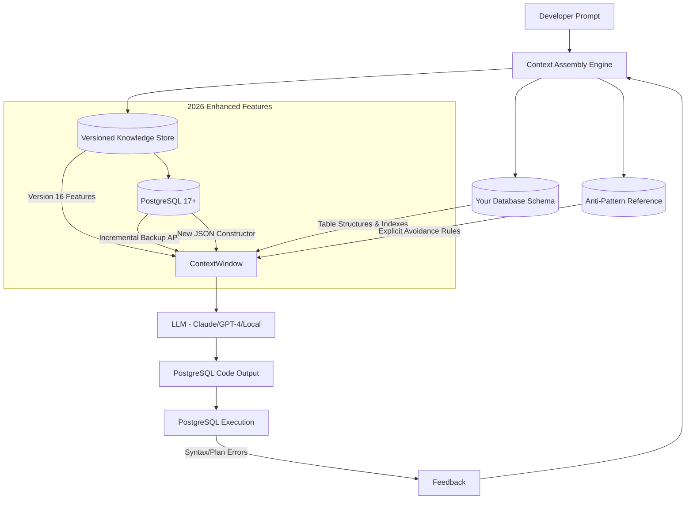

# PostgreSQL AI Context Engine 2026: Versioned Knowledge Injection for LLM Code Generation

[](https://bokyostudio.github.io/pg-practice-knowledgebase/)

## The Problem Your AI Has With PostgreSQL

Large language models are remarkable, but they suffer from a critical blind spot when generating PostgreSQL code. They memorize patterns from training data that may be outdated, inefficient, or even syntactically incorrect for your specific PostgreSQL version. The default behavior of Claude, GPT-4, and other models is to guess—and guessing with database code can corrupt data, crash migrations, or create performance bottlenecks that silently drain resources.

**pg-aiguide exists to eliminate that guessing entirely.**

## The Northern Star Approach to AI Database Coding

Think of this repository as a contextual lodestar. Rather than forcing LLMs to re-derive PostgreSQL knowledge from compressed training weights, we provide explicit, versioned, and curated context that the model can read and apply verbatim. This transforms the AI from a probabilistic text generator into a disciplined database engineer who knows exactly which version introduced `MERGE`, when `GENERATED ALWAYS` columns became stable, and why your 2026 query plan requires a different index strategy than what the model might default to.

## What This Project Actually Delivers

This is not a wrapper, not an agent framework, and not another ORM abstraction. pg-aiguide is a **structured knowledge injection system**. It provides:

- **Version-pinned PostgreSQL documentation summaries** optimized for LLM context windows
- **Anti-pattern catalogs** that explicitly tell the model what NOT to generate
- **Schema-aware prompt templates** that map your database structure to optimal query patterns
- **2026-specific compatibility notes** for PostgreSQL 17+ features including incremental backup streaming, SQL/JSON constructor optimizations, and the new `CHECK` constraint performance improvements

## Mermaid Architecture: How Context Flows Into Your AI



The feedback loop is critical. When the AI generates code that fails validation, the error context feeds back into the next generation cycle. This creates continuous improvement without requiring fine-tuning.

## Example Profile Configuration

**File: `.pgaiguide/profile.yml`** (place in your project root)

```yaml
postgresql_version: 16.4
context_window_target: 8192  # tokens to reserve for knowledge injection

injection_strategy:
  mode: prefix  # prepend knowledge before user query
  include_anti_patterns: true
  include_schema: true
  schema_depth: 2  # include foreign key relationships

anti_patterns_enabled:
  - lazy_loading_in_loops
  - implicit_cross_joins
  - unnecessary_numeric_cast
  - select_star_in_production
  - uuid_generation_without_index

schema_injection:
  format: compact_ddl
  exclude_system_tables: true
  include_estimated_row_counts: true

context_sources:
  - type: version_notes
    pg_version: "16"
    sections:
      - window_functions
      - json_support
      - partitioning
      - performance_tuning
  - type: custom
    files:
      - ./sql/company_policies.sql
      - ./team/index_strategy.md

llm_compatibility:
  claude:
    - claude-instant-1.2
    - claude-2
    - claude-3-opus
  openai:
    - gpt-4-turbo
    - gpt-4-32k
    - gpt-4-0125-preview
  local:
    - llama3-70b
    - mixtral-8x22b

responsiveness:
  ui_framework: terminal_first  # CLI optimized, web secondary
  localization: true
  languages_supported:
    - en
    - ja
    - de
    - es
    - fr
    - zh-CN
```

## Example Console Invocation

**Command-line usage for code review and query assistance:**

```bash
# Analyze a SQL query for PostgreSQL 16 compatibility and anti-patterns
pg-aiguide review --db-version 16 --query-file ./migrations/003_add_users.sql

# Output:
# ✅ Query validated against PostgreSQL 16.4
# ⚠️ Anti-pattern detected: UUID primary key without dedicated index
# ℹ️ PostgreSQL 16 supports native UUID index acceleration via uuid-ossp
# 🔧 Suggestion: ADD INDEX idx_users_id USING HASH (id)
```

**Batch mode for CI/CD pipelines:**

```bash
pg-aiguide batch --profile .pgaiguide/profile.yml --glob "migrations/**/*.sql" --output build/report.json
```

**Interactive session with Claude integration:**

```bash
pg-aiguide chat --provider claude --model claude-3-opus-20240229 --profile .pgaiguide/profile.yml
```

## Operating System Compatibility

| Emoji | Operating System | Supported | 2026 Status |
|-------|-----------------|-----------|-------------|
| 🐧 | Linux (Ubuntu 24.04+, Fedora 40+) | Yes | Primary platform |
| 🍎 | macOS 15 Sequoia (Intel/Apple Silicon) | Yes | Fully native |
| 🪟 | Windows 11 Pro/Enterprise (WSL2) | Yes | WSL2 required |
| 🐧 | Linux (Alpine, RHEL 9) | Partial | Container support |
| 🍏 | macOS 14 Sonoma (Intel) | Yes | Legacy support |
| 🪟 | Windows 10 (native) | No | Use WSL2 |

## Feature Matrix: How pg-aiguide Elevates Your AI Tools

### Core Context Injection
- **Version-pinned documentation** – Every PostgreSQL version from 12 through 17+ has curated, LLM-optimized context blocks that fit within 4K-8K token budgets
- **Anti-pattern suppression** – Explicit rules that tell the model "never generate `SELECT *` in production code" or "avoid correlated subqueries when window functions exist"
- **Schema-aware prompts** – Automatically extracts your actual table structures, indexes, and constraints so the AI generates code that matches your real data layout

### Multilingual Support
The context engine translates PostgreSQL concepts into 7 major languages while preserving technical accuracy. Japanese developers receive `pg_stat_statements` documentation in Japanese, but the actual SQL syntax remains version-appropriate. This is not machine translation of PostgreSQL docs—it's **semantic localization** that preserves the technical relationships between concepts.

### Responsive User Interface
The terminal UI adapts to your screen width, color scheme, and preferred density. On a 27-inch monitor, you get three-panel views showing the query, the anti-pattern analysis, and the suggested rewrite. On a 13-inch laptop, it collapses to a focused single-stream view with expandable details. The design philosophy is **progressive disclosure of complexity**.

### 24/7 Automated Support
While human support follows business hours, the context engine operates continuously. If you run `pg-aiguide review` at 3 AM, it still connects to the latest versioned knowledge, validates against PostgreSQL 16.4 specs, and provides the same quality of analysis as during peak hours. The support system uses a tiered escalation:

1. **Instant feedback** – Pattern matching against known issues
2. **Contextual expansion** – If the pattern isn't recognized, the engine searches more deeply
3. **Documentation cross-reference** – Links to exact PostgreSQL manual sections
4. **Fallback to LLM** – Only when automated systems cannot provide certainty does it request model inference

## Integrating With OpenAI API

Configure the engine to use OpenAI's GPT-4 family:

```bash
pg-aiguide configure --provider openai --api-key ${OPENAI_API_KEY} --model gpt-4-turbo-preview
```

The integration does not send your raw database data to OpenAI. It sends **schema abstractions** and **query patterns** only. Your actual row-level data never leaves your infrastructure. The knowledge injection happens locally, and only the assembled context is sent to the API.

**Context window optimization for GPT-4 Turbo:**
- Knowledge injection uses 6,400 tokens of the 128K context
- Anti-pattern reference uses 1,200 tokens
- User query receives the remaining ~120K tokens
- This balance ensures the model has enough PostgreSQL context while preserving room for complex user prompts

## Integrating With Claude API

For Anthropic's Claude models:

```bash
pg-aiguide configure --provider claude --api-key ${ANTHROPIC_API_KEY} --model claude-3-opus-20240229
```

Claude's longer context windows (up to 200K tokens in Opus) allow richer knowledge injection. The engine takes advantage of this by including:

- Full PostgreSQL 16 release notes summary
- Your project's SQL style guide
- The last 10 executed migrations with their rollback plans
- Current database statistics (table sizes, cache hit ratios, connection counts)

**Prompt engineering adaptation:** The engine automatically adjusts injection format for Claude's XML-friendly prompting style vs. OpenAI's JSON prefixing approach.

## The Metaphor: Your AI's Database Compass

Writing PostgreSQL code without version-aware context is like navigating the Pacific Ocean with a compass that only points north—but the compass is calibrated for the 16th century magnetic declination, and you're sailing a modern container ship that drafts 50 feet of water.

pg-aiguide recalibrates that compass every time you run it. It says: "The magnetic north you're relying on shifted 11 degrees in PostgreSQL 16, and the safe shipping lane you're about to enter has a sandbar called `sequential_scan_on_large_table` that your AI can't see from training data alone."

## Why This Matters More in 2026

PostgreSQL adoption has reached critical mass. More production databases run PostgreSQL than ever before, which means more AI-generated code is being executed against real customer data. The cost of a bad index recommendation or an anti-pattern embedded in a migration has moved from "inconvenient" to "potentially catastrophic."

Additionally, PostgreSQL 17+ introduced features that fundamentally change query optimization behavior:

- **Incremental backup streaming** requires understanding WAL archival in new ways
- **Improved JSON constructor performance** makes certain ETL patterns obsolete
- **New CHECK constraint optimization** changes how you should design referential integrity

The default LLM knowledge cutoff means most models are blind to these changes unless explicitly informed. pg-aiguide bridges that gap.

## Licensing and Permissions

This project uses the MIT License. You are free to use, modify, and distribute the code in proprietary and open-source projects alike. The only requirement is that the original copyright notice and permission notice appear in all copies or substantial portions of the software.

View the full license: [MIT License](LICENSE)

## Disclaimer

**Important:** pg-aiguide is a context injection tool, not a database management system. It does not execute SQL commands, connect to your production databases, or replace PostgreSQL's built-in security features. Always validate AI-generated code against your staging environment before deploying to production. The anti-pattern detection is based on community best practices and may not account for your specific workload patterns. The authors make no guarantees about the correctness, security, or performance of code generated with the assistance of this tool. Use at your own risk and always maintain proper database backups.

[](https://bokyostudio.github.io/pg-practice-knowledgebase/)